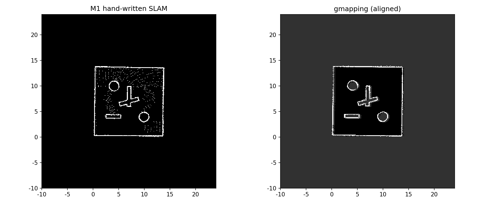

# 手写 2D 栅格 SLAM：从“最小闭环”到和 gmapping 的对比

> 本仓库 [m1_slam_sim](../m1_slam_sim/) 的配套博客。目的：在接触 Cartographer / slam_toolbox 之前，先用纯 Python 把 SLAM 的核心直觉跑通——**地图和位姿互相修正**。

## 1. 为什么先手写一遍

ROS 里一个 `rosrun gmapping slam_gmapping` 就能建图，但它是个黑盒。手写版本能回答三个问题：

1. 只用里程计为什么建图会重影？——里程计漂移（距离放大、陀螺偏置、噪声）会一路累积，地图被“拖花”。
2. 扫描匹配在修什么？——修的是位姿：在里程计预测位姿附近，搜索一个“激光端点最贴合已有地图”的位置。
3. 为什么地图会越建越准？——地图变好后，匹配更有依据；位姿更准后，地图又更干净，这就是闭环。

## 2. 最小闭环的三个零件

### 2.1 占位栅格地图（Occupancy Grid Map）

每束激光做两件事：

- 射线**穿过**的栅格：空闲，log-odds 减一点（`lo_miss = -0.2`）
- 射线**终点**（撞墙）的栅格：占据，log-odds 加一点（`lo_hit = 1.5`）

概率 = `1 / (1 + exp(-logodds))`。为什么不用直接概率？因为 log-odds 相加就是贝叶斯更新，多帧叠加不会溢出，且天然对称。

关键细节：只把“激光到达之前”的区域标空闲，给墙留 0.4m 余量，防止斜射把薄墙“擦掉”；强占据格不接受空闲更新（保护已建好的墙）。

### 2.2 相关扫描匹配（Correlative Scan Matching）

里程计给出“猜的位姿”，匹配在附近搜一个分数最高的位姿：

```
分数 = 把激光端点投影到地图后，占据概率之和
```

实现是两级搜索：粗搜（0.2m / 2°）→ 精搜（0.05m / 0.5°）。地图先做 3×3 模糊，让墙“变厚”，产生平滑的分数梯度，避免掉进错误的局部最优。

### 2.3 验收门槛

不是每次匹配都接受：修正后分数必须明显优于预测位姿，否则退回预测。这防止地图还没建好时被噪声带偏。

## 3. 实验一：基线（45s 绕圈建图）

| 指标 | 只用里程计 | 扫描匹配修正 |
|---|---|---|
| 轨迹 RMSE | 0.496 m | 0.315 m |
| 地图与真值 IoU | 0.126 | 0.346 |

重影图 vs 清晰图见 `m1_slam_sim/output/m1_slam_compare.png`。

## 4. 实验二：参数扫描（`python3 experiment.py`）

同一组数据，改漂移大小和搜索窗口：

| 配置 | RMSE 里程计 | RMSE 修正 | IoU 里程计 | IoU 修正 | 耗时 |
|---|---|---|---|---|---|
| 基线 | 0.496 | 0.315 | 0.126 | 0.346 | 54s |
| 距离误差大（speed=1.05） | 0.656 | 0.374 | 0.111 | 0.350 | 54s |
| 角偏置大（bias=0.003） | 0.267 | 0.349 | 0.142 | 0.331 | 54s |
| 窗口小（coarse=0.2） | 0.496 | 0.453 | 0.126 | 0.272 | 51s |
| 窗口大（coarse=0.8） | 0.496 | 0.347 | 0.126 | 0.349 | 81s |

读法：

- **漂移越大，修正的收益越明显**（距离误差大时 RMSE 从 0.656 压到 0.374）。
- **窗口太小会跟丢**（coarse=0.2 时修正 RMSE 反而 0.453，IoU 最低）。
- **窗口太大只是变慢**（0.8 时精度没提升，耗时从 54s 涨到 81s）。
- 角偏置大那档，轨迹 RMSE 出现“修正比里程计差”的意外——因为这一档的里程计误差恰好与真值抵消了一部分；但**地图 IoU 修正后仍然更高（0.331 vs 0.142）**。单一指标会骗人，地图质量才是更稳的判据。

## 5. 实验三：和 gmapping 同输入对比

想法：给两个算法喂**完全相同的激光/里程计**，比地图质量。步骤（见 [m1_slam_sim/compare_gmapping.py](../m1_slam_sim/compare_gmapping.py)）：

1. `python3 make_ros_bag.py` 把 M1 仿真数据导出成 rosbag（`/scan`、`/odom`、`/tf`、真值）
2. `python3 compare_gmapping.py --with-gmapping`：M1 侧直接出地图和指标，gmapping 侧离线回放建图
3. 两张地图按占据格互相关对齐后算 IoU，出对比图 `output/m1_vs_gmapping.png`

### 5.1 结果

| 算法 | 轨迹 RMSE（对真值） | 地图与真值 IoU | 与对方地图对齐后 IoU |
|---|---|---|---|
| M1 手写（相关匹配） | 0.315 m | 0.346 | — |
| gmapping（RBPF，80 粒子） | — | — | 0.019 |

两张地图对齐需要平移约 (2.7 m, 2.4 m)——这是两种算法各自"map 原点"的差异，属正常。关键在最后一项：**对齐之后两张地图几乎不重叠**。看图更直观（左：M1，右：gmapping）：



### 5.2 为什么 gmapping 的地图是"涂抹"的

先排除数据问题：这份 bag 里 odom 相对真值的最终偏差只有 **0.33 m、0.046 rad**，完全在正常范围。所以涂抹不是数据坏了，而是**环境 + 算法**共同作用：

- 本实验的仿真房间是 **14 m 的空方形房间，四面墙完全对称、内部零特征**；
- gmapping 用粒子滤波估计位姿，在这种环境里会出现**感知混叠（perceptual aliasing）**：某面墙的激光轮廓和对面墙几乎一样，粒子群"认错墙"后沿墙滑移，回环处墙就画成了宽约 26 m 的涂抹带；
- M1 用的是**穷举相关扫描匹配**：每帧在局部搜索窗口里找"地图分数最高"的位姿，不依赖粒子群的多样性，对称环境下反而不容易滑移。

这个结果恰好呼应实验二的结论：**单一指标会骗人，算法失效模式要放到具体环境里看**。真实系统很少这么极端（有箱子、门、柱子等特征，且会用回环检测/多传感器），所以这更像是"SLAM 的退化场景测试"，而不是"gmapping 不行"。

### 5.3 同输入对比的三个坑（排错记录）

离线回放喂 gmapping 时容易踩三个坑，脚本里都已处理：

1. **静态变换必须发 `/tf_static`**：tf1 只把 `/tf_static` 当"任意时刻有效"；发在 `/tf` 且只写一次，gmapping 的消息过滤器按扫描时间戳查询会全部外推失败（`MessageFilter Dropped 100%`）。脚本里同时做了防御：每帧 `/tf` 都附带静态变换。
2. **gmapping 参数名是 `base_frame`/`odom_frame`/`map_frame`**（不是 `base_frame_id`），且对这种低噪声合成数据要调小更新阈值（`linearUpdate`/`angularUpdate`）并加大粒子数。
3. **rosbag 回放时同时间戳跨话题投递顺序不定**：扫描和 `/tf` 时间戳相同会导致扫描先到、tf 后到而丢帧；把扫描消息的回放时间推迟 0.2 s 即可稳定复现。

### 5.4 延伸实验：换带特征的环境

把同样的对比放到 **turtlebot3_world（有箱子和障碍物）** 里重跑，gmapping 的地图质量会明显回升——因为特征打破了对称性，粒子滤波不再混叠。注意那时不再是"同一份输入"，比较的意义从"算法对决"变成"环境如何影响算法"——这本身也是值得写的一节。

## 6. 这跟真实系统有什么关系

- 相关扫描匹配 = Cartographer 局部匹配 / 激光 ICP 的“概念原型”
- 两级粗精搜索 = 多分辨率搜索的简化版
- 地图模糊 + 验收门槛 = 真实系统里的鲁棒性处理（局部最优、拒绝误匹配）
- gmapping 是 RBPF（粒子滤波），它把“位姿估计”变成了“一群粒子投票”，这是比本实验更重的一步——所以博客 01 里建议：先懂本实验，再看 gmapping 就不晕了

## 7. 自测题

1. 为什么只用里程计建图会重影？扫描匹配修正的到底是什么？
2. 栅格地图为什么用 log-odds 更新而不是直接用概率？
3. 相关扫描匹配的搜索窗口大小由什么决定？

参考答案见 [docs/self_test_answers.md](../docs/self_test_answers.md)。
